# Assignment 0 + 1
Goals: In this assignment, you will learn the basics of rendering with PyTorch3D,
explore 3D representations, and practice constructing simple geometry.

You may also find it helpful to follow the [Pytorch3D tutorials](https://github.com/facebookresearch/pytorch3d).

## Table of Contents
0. [Setup](#0-setup)
1. [Practicing with Cameras](#1-practicing-with-cameras-15-points) (15 Points)
2. [Practicing with Meshes](#2-practicing-with-meshes-10-points) (10 Points)
3. [Re-texturing a mesh](#3-re-texturing-a-mesh-10-points) (10 Points)
4. [Camera Transformations](#4-camera-transformations-10-points) (10 Points)
5. [Rendering Generic 3D Representations](#5-rendering-generic-3d-representations) (45 Points)
6. [Do Something Fun](#6-do-something-fun-10-points) (10 Points)
7. [Extra Credit](#extra-credit-7-sampling-points-on-meshes-10-points) (10 Points)

## 0. Setup

You will need to install Pytorch3d. See the directions for your platform
[here](https://github.com/facebookresearch/pytorch3d/blob/main/INSTALL.md).
You will also need to install Pytorch. If you do not have a GPU, you can directly pip
install it (`pip install torch`). Otherwise, follow the installation directions
[here](https://pytorch.org/get-started/locally/).

Other miscellaneous packages that you will need can be installed using the 
`requirements.txt` file (`pip install -r requirements.txt`).

If you have access to a GPU, the rendering code may run faster, but everything should
be able to run locally on a CPU. Below are some sample installation instructions for a Linux Machine. 

For GPU installation, we recommend CUDA>=11.6.

```bash
# GPU Installation on a CUDA 11.6 Machine
conda create -n learning3d python=3.10
conda activate learning3d
pip install torch --index-url https://download.pytorch.org/whl/cu116 # Modify according to your cuda version. For example, cu121 for CUDA 12.1
pip install fvcore iopath
conda install -c bottler nvidiacub (required for CUDA older than 11.7)
MAX_JOBS=8 pip install "git+https://github.com/facebookresearch/pytorch3d.git@stable" # This will take some time to compile!
pip install -r requirements.txt

# CPU Installation
conda create -n learning3d python=3.10
conda activate learning3d
pip install torch --index-url https://download.pytorch.org/whl/cpu
pip install fvcore iopath
MAX_JOBS=8 pip install "git+https://github.com/facebookresearch/pytorch3d.git@stable"
pip install -r requirements.txt

```

Make sure that you have gcc $\ge$ 4.9.

## 1. Practicing with Cameras (15 Points)

### 1.1. 360-degree Renders (5 points)

Ceating360-degree gif video that shows many continuous views of the
provided cow mesh.
* If you run in terminal:
```bash
python render_360.py
```
* you will get following output:

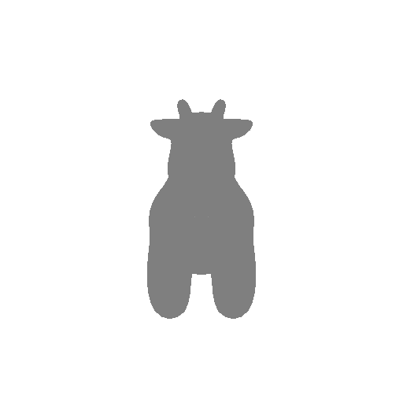

### 1.2 Re-creating the Dolly Zoom (10 points)

The [Dolly Zoom](https://en.wikipedia.org/wiki/Dolly_zoom) is a famous camera effect,
first used in the Alfred Hitchcock film
[Vertigo](https://www.youtube.com/watch?v=G7YJkBcRWB8).
The core idea is to change the focal length of the camera while moving the camera in a
way such that the subject is the same size in the frame, producing a rather unsettling
effect.
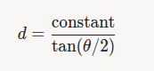
d: distance
$\theta$ is the FOV in degrees
* If you run in terminal:
```bash
python dolly_zoom.pywd
```
* you will get following output:

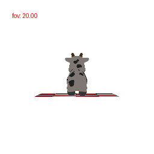


## 2. Practicing with Meshes (10 Points)

### 2.1 Constructing a Tetrahedron (5 points)
#### 1. Geometry
**Vertices**: A regular tetrahedron is defined with 4 vertices:

\[
V = \begin{bmatrix}
(0, 0, 0), & (1, 0, 0), & \left(0.5, \frac{\sqrt{3}}{2}, 0\right), & \left(0.5, \frac{\sqrt{3}}{6}, \frac{\sqrt{2}}{3}\right)
\end{bmatrix}
\]

**Faces**: The tetrahedron has 4 triangular faces:

\[
F = \begin{bmatrix}
(0, 1, 2), & (0, 1, 3), & (1, 2, 3), & (0, 2, 3)
\end{bmatrix}
\]
Vertex Colors: Each vertex is assigned a distinct RGB color (Red, Green, Blue, Yellow).
#### 2. Usage
```bash
python tetrahedron.py
```
#### 3. output
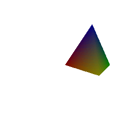


### 2.2 Constructing a Cube (5 points)
#### Core formulas

1. **Cube Geometry**:

   **Vertices**: A cube is defined with 8 vertices, centered at \((0, 0, 0)\):

   \[
   V = \begin{bmatrix}
   (-0.5, -0.5, -0.5), & (0.5, -0.5, -0.5), & (0.5, 0.5, -0.5), & (-0.5, 0.5, -0.5), \\
   (-0.5, -0.5, 0.5), & (0.5, -0.5, 0.5), & (0.5, 0.5, 0.5), & (-0.5, 0.5, 0.5)
   \end{bmatrix}
   \]

   **Faces**: The cube has 6 faces, each represented by two triangles (12 triangles total):

   \[
   F = \begin{bmatrix}
   (0, 1, 2), & (0, 2, 3), & (4, 5, 6), & (4, 6, 7), \\
   (0, 1, 5), & (0, 5, 4), & (1, 2, 6), & (1, 6, 5), \\
   (2, 3, 7), & (2, 7, 6), & (3, 0, 4), & (3, 4, 7)
   \end{bmatrix}
   \]

   **Textures**: All vertices are assigned a uniform sky-blue color (\(RGB = [0.1, 0.7, 1.0]\)).

2. **Rendering**:
   - The camera rotates around the cube at a fixed distance (\(d = 2.7\)) and elevation (\(20^\circ\)) with azimuth angles (\(\theta\)) from \(0^\circ\) to \(360^\circ\) over \(N=36\) frames:
     \[
     \theta = \text{linspace}(0, 360, 36)
     \]
   - A point light source is placed at \((2.0, 2.0, 2.0)\).
   - The `MeshRenderer` with `HardPhongShader` is used to render the cube with the specified texture and lighting.

3. **Animation**:
   - Each frame is rendered with a different azimuth angle and saved as an image.
   - The images are compiled into a GIF with a frame duration of 0.1 seconds.

#### Usage

Run the script to generate `cube.gif`:

```bash
python cube.py
```
#### output


## 3. Re-texturing a mesh (10 points)

Now let's practice re-texturing a mesh. For this task, we will be retexturing the cow
mesh such that the color smoothly changes from the front of the cow to the back of the
cow.

More concretely, you will pick 2 RGB colors, `color1` and `color2`. We will assign the
front of the cow a color of `color1`, and the back of the cow a color of `color2`.
The front of the cow corresponds to the vertex with the smallest z-coordinate `z_min`,
and the back of the cow corresponds to the vertex with the largest z-coordinate `z_max`.
Then, we will assign the color of each vertex using linear interpolation based on the
z-value of the vertex:
```python
alpha = (z - z_min) / (z_max - z_min)
color = alpha * color2 + (1 - alpha) * color1
```
usage:
```bash
python retexture_a_mesh.py
```

output:

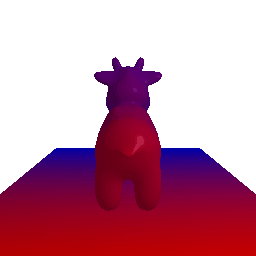

In this case, `color1 = [0, 0, 1]` and `color2 = [1, 0, 0]`.


## 4. Camera Transformations (10 points)

When working with 3D, finding a reasonable camera pose is often the first step to
producing a useful visualization, and an important first step toward debugging.

Running `python -m starter.camera_transforms` produces the following image using
the camera extrinsics rotation `R_0` and translation `T_0`:

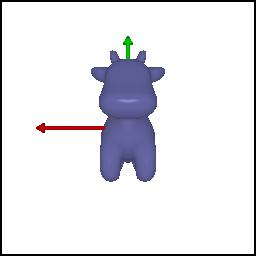


What are the relative camera transformations that would produce each of the following
output images? You should find a set (R_relative, T_relative) such that the new camera
extrinsics with `R = R_relative @ R_0` and `T = R_relative @ T_0 + T_relative` produces
each of the following images:


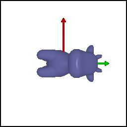
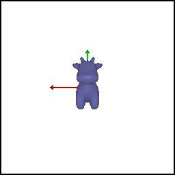
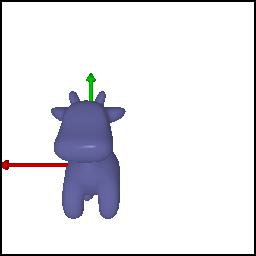
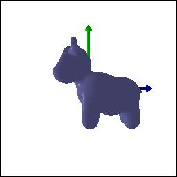

change the value of  R_relative and T_relative to get different camera position
**Usage**
```bash
python camera_transform.py
```

## 5. Rendering Generic 3D Representations (45 Points)

1. **Point Cloud**:
   - A collection of 3D points with coordinates \((x, y, z)\) and RGB colors, loaded from `data/bridge_pointcloud.npz`.
   - The `stride=20` parameter reduces the number of points for faster rendering.

2. **Rendering**:
   - Uses `PointsRenderer` with `PointsRasterizer` to project points onto a 2D image plane.
   - Camera parameters are defined using `look_at_view_transform` with distance (`dist=4`), elevation (`elev=10`), and azimuth (`azim`) angles.
   - A white background is applied via `AlphaCompositor`.
3. **useage**
```bash
python render_point_cloud.py
```
4. **output**
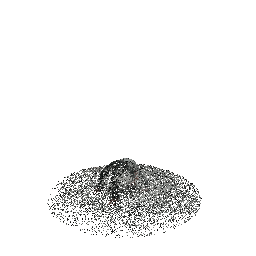
